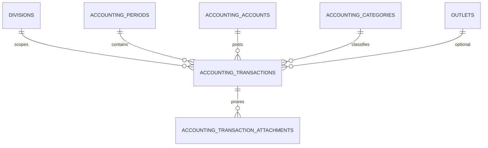

## Jurnal Aktual Accounting

Modul ISSUE-7 menyimpan jurnal Rupiah bulat dalam `BIGINT`, menampilkan nominal sebagai decimal string (`"125000.00"`), dan membatasi seluruh akses ke user divisi ACC dengan capability yang sesuai.

## ERD

`accounting_transactions` memiliki UUID, FK division/period/account/category/outlet, tanggal, deskripsi, referensi, debit/credit BIGINT, draft flag, metadata soft-cancel, version optimistic lock, idempotency key dan hash payload, actor, dan timestamp. Attachment menyimpan metadata file privat; isi file berada pada disk `local` dan hanya diunduh melalui endpoint terotorisasi.

## Aturan bisnis

- Tepat satu dari debit/kredit harus berupa integer positif; sisi lain nol.
- Periode `draft`/`reopened` dapat dimutasi. Status lain menghasilkan `422 PERIOD_LOCKED`.
- Kategori harus aktif. Kategori `requires_outlet` memerlukan outlet aktif yang terhubung ke rekening melalui `accounting_account_outlets`.
- Saldo berjalan hanya memakai row aktif dan urutan `transaction_date, created_at, id` ascending.
- Cancel bersifat soft-cancel, menyimpan alasan/aktor/waktu, menaikkan version, dan menulis audit.
- `version` yang usang menghasilkan `409 VERSION_CONFLICT`. `Idempotency-Key` pada create mengembalikan transaksi yang sama untuk retry identik dan menghasilkan `409 IDEMPOTENCY_CONFLICT` bila payload berbeda.
- Kesiapan pengajuan mensyaratkan minimal satu transaksi aktif dan seluruh transaksi aktif memiliki bukti.

## Kontrak API

Semua endpoint memakai `/api/v1/accounting`, JWT, scope ACC, dan envelope sukses `{data, meta:{trace_id,total?}, links?}`. Error memakai `{error:{code,message,trace_id,fields?}}`.

- `GET /transactions` — filter period/account/category/outlet/date/draft/cancelled/search dan hasil dengan running balance.
- `POST /transactions` — create; header opsional `Idempotency-Key` (maksimum 100 karakter).
- `GET /transactions/{id}` dan `PUT /transactions/{id}` — detail/update; kirim `version` untuk optimistic concurrency.
- `POST /transactions/{id}/cancel` — body `cancellation_reason`.
- `POST /transactions/{id}/attachments` — multipart JPG/PNG/PDF maksimum 5 MB.
- `GET /transactions/{id}/attachments/{attachmentId}/download` — unduh privat setelah scope dan ownership transaksi diverifikasi.
- `GET /transactions/summary?period_id=...` — total aktif dan status kesiapan pengajuan.

Mutasi memerlukan `submit:acc_period`; pembacaan memerlukan `view:acc_report`. BOD dan user non-ACC ditolak server-side. Audit menyimpan trace ID yang disanitasi dan tidak menyimpan token, session cookie, atau isi bukti.

## Migrasi dan rollback

Migrasi `000018` harus di-rollback sebelum `000017` karena foreign key attachment ke transaksi. Rollback standar: `php artisan migrate:rollback --step=2`; kemudian jalankan kembali `php artisan migrate` untuk verifikasi round-trip. Rollback menghapus data jurnal dan metadata attachment; file pada storage perlu dipindahkan/diarsipkan sesuai prosedur operasional sebelum rollback produksi.
