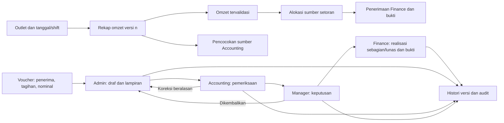

# Reset Accounting: menu, role, data dan rancangan layar

8 Oktober 2026. Peran: Senior Product Manager, Senior Product Designer, Senior Fullstack Programmer, Application Security Engineer.

## Keputusan produk

Pengguna meminta navigasi Accounting direset dan dibuat ulang. Acuan visual adalah Divisi Project, bukan menu Project. Beranda menjadi dashboard pemantauan bagi seluruh role yang berizin; pekerjaan disajikan melalui register dokumen dan submenu proses bisnis. Data dan API existing dipertahankan. Link lama dialihkan dengan query/detail tetap utuh; tidak menghapus transaksi perusahaan.

Backup source sebelum perubahan: C:/ERP/backups/pre-cellular-2026-10-08T02-38-58-637Z/source.snapshot.aes, commit c8a3463. Enkripsi, Git bundle, archive dan hash dekripsi terverifikasi. Tidak ada migrasi/transaksi database untuk reset navigasi dan UI ini.

## Peta menu aktif yang dibangun ulang

- Dashboard Accounting: ringkasan database, tren omzet, status pengajuan dan jadwal realisasi.
- Dokumen & persetujuan: Register dokumen; Pengajuan Admin; Pemeriksaan Accounting; Persetujuan Manager; Realisasi Finance. Submenu tindakan hanya muncul untuk capability terkait.
- Pendapatan outlet: Rekap omzet H+1; Analisis omzet outlet; Pemeriksaan sumber Cellular.
- Tagihan & pengeluaran: Voucher pengeluaran. Jenis billing/purchasing/operasional tetap tipe dokumen, bukan tiga database terpisah.
- Kas & bank: Setoran & penerimaan; Pencocokan setoran; Rekonsiliasi bank; Laporan cashflow.
- Administrasi pegawai: Cuti & absensi. Rekap persediaan belum memiliki sumber ledger Accounting lintas outlet; tidak mengklaim melihat seluruh stok dari endpoint Cellular yang berscope lain.
- Pembukuan & kontrol: Catatan transaksi; Hutang & piutang; Periode & penutupan; Master akun & kategori; Impor transaksi.

Submenu adalah navigasi nyata, dapat buka/tutup, grup aktif otomatis terbuka, keyboard dan mobile didukung. Finance FIN tetap dapat masuk ACC sesuai policy existing; tidak memberi akses HR atau data source tambahan. Mode sidebar kecil tetap memberikan tautan yang berlabel.

## Matriks kewenangan

Ini kontrak tindakan untuk alur inti. Endpoint tetap memeriksa capability, scope dan kondisi dokumen, bukan hanya menyembunyikan tombol UI.

| Proses | Admin ACC | Staff Accounting ACC | Manager ACC | Staff Finance ACC/FIN |
| --- | --- | --- | --- | --- |
| Rekap omzet | Buat/edit draf, ajukan, koreksi | Periksa/validasi, kembalikan | Keputusan selisih, izin terlambat | Baca sesuai izin |
| Voucher | Buat/edit, lampiran, ajukan | Periksa, kembalikan, teruskan | Setujui/kembalikan | Baca voucher disetujui, catat realisasi/bukti |
| Setoran | Catat dari sumber tervalidasi | Baca/cocokkan sumber | Baca, pembatalan beralasan sesuai policy | Catat penerimaan/bukti |
| Periode | Ajukan sesuai capability | Ajukan sesuai capability | Setujui/kelola periode | Ajukan sesuai capability |
| Pegawai | Kelola rekap sesuai izin | Baca data pendukung | Kelola sesuai izin | Tidak diberi akses HR |

Head Operasional, SPV dan Leader ACC mendapat dashboard ringkasan, tanpa tautan rincian/mutasi. Admin Gudang ACC juga tidak diberi akses dokumen uang hanya berdasarkan jabatan; integrasi inventory mengikuti scope sumber dan pekerjaan berikutnya. BOD hanya membaca sesuai whitelist. Tidak menambahkan role kesembilan atau permission baru.

Policy existing masih memberi Admin/Finance penulisan catatan transaksi legacy dan Staff Accounting akses baca. Catatan ini belum jurnal double-entry/buku besar enterprise; reset UI tidak menyamarkannya menjadi buku besar. Perubahan kewenangan posting baru harus mengikuti desain ledger berikutnya.

## Hubungan data dan alur lengkap

Voucher disetujui berbeda dari dibayar. Catatan realisasi tidak mengirim uang atau otomatis memposting jurnal. Bukti tagihan berbeda dari bukti pembayaran. Setoran berbeda dari penerimaan bank dan tidak mengganti nilai omzet. Draf/pengembalian bukan transaksi baru; koreksi memakai versi dokumen yang sama. Alur Finance hanya membuka dokumen approved, dengan sisa dan bukti; pembuat/pemeriksa/approver tetap dibatasi aturan server existing.

## Rancangan layar

1. Dashboard: header/badge modul mengikuti Project; KPI terverifikasi, grafik tren dan tabel jadwal realisasi. Sidebar proses menggantikan deretan shortcut/menu cards.
2. Register: header proses, jenis dokumen, bulan/outlet, status sebagai tab/count ringkas. Tabel dokumen memuat referensi, outlet/tanggal, nominal, status, penanggung jawab tahap berikutnya dan aksi. Pagination server dan error terpisah dari nol.
3. Detail voucher: identitas/nomor/status/versi, tahap Admin–Accounting–Manager–Finance, kebutuhan/penerima, lampiran, pemeriksaan/keputusan, realisasi dan histori. Aksi aktif sesuai role/status; fase pembayaran baru tersedia setelah approved.
4. Detail omzet: identitas outlet/tanggal/shift/status/versi, rincian kanal, sumber dan catatan, H+1/izin, validasi/selisih serta histori. Selisih AP bukan laba.
5. Setoran: sumber tervalidasi, tanggal/kanal/nominal/tujuan/bukti, penerimaan Finance dan sisa, serta penelusuran kembali ke sumber.

## Menu target yang belum boleh dianggap tersedia

Rekap persediaan lintas divisi, data pendukung PNL/bonus, rekonsiliasi Ecsys persisten, buku besar/neraca saldo, PNL dan analisis beban, laporan tenant lengkap, administrasi pajak, kontrak outlet, pas bandara dan surat-menyurat, serta CMO. Menu ini tercantum dalam backlog, tidak dipasang sebagai tombol kosong atau perhitungan fiktif. Fondasi serta aturan sumber/perhitungan perlu diimplementasikan agar menu aktif mempunyai fungsi nyata.

## Todo dan acceptance

- [x] Analisis visual Project dan policy/API Accounting, backup source terverifikasi.
- [x] Peta menu, matriks role, relasi data dan rancangan layar sebelum kode.
- [x] Sidebar submenu, reset menu dan alias URL lama.
- [x] Dashboard acuan Project dan register dokumen berbasis tabel, fokus role.
- [x] Detail tahapan voucher/omzet serta konteks penanggung jawab/aksi.
- [x] Test navigasi role/alias/status/pagination dan regresi frontend.
- [x] QA browser tema terang/gelap/mobile dan alur detail; tidak melakukan pembayaran nyata.
- [x] Commit/push REQ tanpa PR.
- [ ] Staging sumber persisten, Ecsys, ledger dan seluruh menu target yang belum memiliki backend.

Dokumen 63/66 tetap menjadi riwayat dan sumber kebutuhan; dokumen 67 menggantikan keputusan navigasi/beranda sebelumnya. Referensi ERP yang sudah ditinjau: Oracle Financials Other Financials Security Considerations dan Payables Security (dokumen official, diakses 8 Oktober 2026); tampilan acuan berasal dari source Project pada repo ini.

## Hasil implementasi 8 Oktober 2026

Keempat peran diterapkan: Senior Product Manager menyusun struktur/kewenangan, Senior Product Designer mengikuti hierarki visual Project, Senior Fullstack Programmer mengimplementasikan navigasi/rute/register/detail, Application Security Engineer memeriksa role, capability, scope dan transisi existing.

Navigasi memakai enam kelompok submenu dan dashboard. Pengajuan, pemeriksaan, persetujuan serta realisasi mengikuti role. Register memakai database melalui API existing, status/count dan pagination server; detail menampilkan versi, penanggung jawab tahap serta aksi berizin. Voucher lunas berbeda dari approved. Alias URL lama mempertahankan bulan/detail/hash. Tidak ada migrasi, penghapusan data, mutasi transaksi native atau perubahan policy backend.

Verifikasi: regresi 43 berkas/196 tes menghasilkan 195 lulus dan satu selector navigasi lama gagal. Selector diperbaiki; seluruh empat tes pada berkas itu kemudian lulus. Typecheck, build, lint seluruh file frontend berubah dan git diff --check lulus. Build tetap memiliki peringatan ukuran chunk Project existing. Backend tidak berubah; tidak ada klaim pengujian backend baru.

QA native Staff Accounting: dashboard, submenu role, antrean voucher submitted dari database, UUID detail yang sama, tahap/pemeriksaan/riwayat, tema terang/gelap dan drawer mobile 390x844. Tidak mengajukan atau membayar voucher nyata. Viewport/tema dipulihkan. Screenshot tersimpan lokal di C:\ERP\ui-proof\accounting-reset-*.jpg. Role lain diuji otomatis; walkthrough native semua role dan penerimaan pengguna tetap terbuka.

Commit/push dilakukan pada REQ tanpa PR. Staging/Ecsys/ledger/PNL/bonus/CMO dan menu target di atas tetap pekerjaan terbuka, tidak digantikan dengan menu kosong.