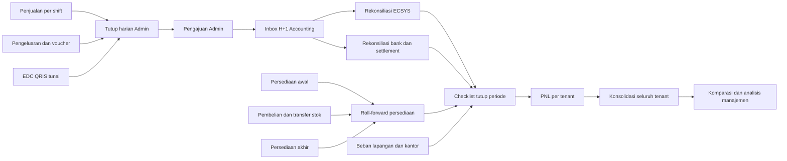

# Analisis Cellular: Admin, Accounting, dan PNL

Tanggal analisis: 9 Oktober 2026  
Status: acuan produk sebelum perubahan aplikasi  
Ruang lingkup: laporan harian September 2026 dan paket PNL Agustus 2026

## 1. Tujuan

Dokumen ini memetakan pekerjaan manual Cellular menjadi alur ERP yang dapat ditelusuri dari transaksi harian sampai PNL per tenant dan konsolidasi. Dokumen tidak menyimpan nominal, nama pegawai, nomor rekening, atau salinan workbook.

## 2. Kesimpulan utama

Data yang diterima bukan sekadar laporan penjualan. Di dalamnya sudah ada tiga lapisan proses bisnis:

1. **Operasional/Admin Cellular** mencatat penjualan harian, omzet per shift, cara bayar, pengeluaran harian, setoran, pembelian, dan mutasi persediaan.
2. **Accounting** merekonsiliasi laporan operasional dengan ECSYS, bank, EDC, QRIS, voucher, pembelian, dan persediaan; menangani selisih; lalu menutup periode.
3. **PNL** menyusun pendapatan, HPP, pendapatan lain, beban lapangan, beban kantor, penyesuaian, marketing, prive, biaya bank/bunga, dan laba/rugi bersih per tenant; hasilnya dikonsolidasikan menjadi komparasi manajemen.

Modul katalog, stok, dan transaksi penjualan yang ada hanya mewakili sebagian kecil pekerjaan Cellular. ERP perlu menjadikan tutup harian, rekonsiliasi, persediaan, period close, dan PNL sebagai alur utama.

## 3. Pemetaan sumber kerja

| Kelompok sumber | Pemilik utama | Fungsi di ERP |
|---|---|---|
| Laporan harian | Admin | Rekap kas/penjualan harian dan bukti sumber dari outlet |
| Pendapatan dan pengeluaran | Admin, Finance | Rekap bruto, kanal pembayaran, pengeluaran, rencana setoran, dan transfer aktual |
| Omzet per shift | Admin | Kontrol shift 1–3 dan rekonsiliasi total harian |
| Rekap seluruh tenant | Manager | Pemantauan omzet lintas tenant tanpa menghitung total konsolidasi sebagai transaksi baru |
| ECSYS | Accounting | Rekonsiliasi laporan outlet terhadap sistem eksternal dan pencatatan selisih |
| Mutasi bank, EDC, dan QRIS | Finance, Accounting | Pencocokan settlement dan kas yang benar-benar diterima |
| Inventory, pembelian, transfer, surat jalan | Admin Gudang, Accounting | Pergerakan stok dan dasar HPP |
| Voucher dan rincian biaya | Admin, Accounting | Dokumen sumber beban dan klasifikasi akun |
| PNL tenant | Accounting | Perhitungan laporan laba rugi satu tenant untuk satu periode |
| Komparasi PNL | Manager, Accounting | Konsolidasi, perbandingan tenant, alokasi biaya bersama, dan analisis target |

Satu workbook dapat memuat beberapa lapisan sekaligus. Karena itu hak akses harus diterapkan pada jenis data dan tindakan, bukan hanya nama file.

## 4. Rantai data yang harus dibangun

## 5. Alur operasional target

### 5.1 Rekap dan pengajuan oleh Admin

Admin memilih tenant, outlet, tanggal, dan shift. Sistem mengambil transaksi penjualan serta meminta rincian tunai, EDC, QRIS, pengeluaran, setoran yang direncanakan, dan lampiran. Sistem menghitung selisih kanal pembayaran terhadap omzet dan menolak pengiriman jika komponen wajib belum lengkap.

Status: `Draft Admin → Diajukan → Diperiksa Accounting → Diverifikasi`, dengan jalur `Perlu Koreksi`. Pemeriksaan settlement oleh Finance dan pemeriksaan stok oleh Admin Gudang menjadi substatus terpisah agar satu pemeriksaan tidak menutupi pemeriksaan lainnya.

### 5.2 Rekonsiliasi oleh Accounting

Staff Accounting menerima satu paket H+1, bukan mencari baris di banyak sheet. Layar membandingkan:

- total shift terhadap total harian;
- omzet outlet terhadap ECSYS;
- EDC/QRIS terhadap settlement;
- setoran rencana terhadap transfer aktual;
- pengeluaran terhadap voucher dan akun biaya;
- pergerakan persediaan terhadap pembelian, penjualan, dan transfer.

Setiap selisih menjadi kasus dengan jenis, nilai, pemilik, batas waktu, komentar, bukti, dan keputusan. Data tidak boleh dipaksakan menjadi nol ketika sumber kosong, tidak berlaku, atau error.

### 5.3 Tutup periode dan PNL

PNL baru dapat dihitung ketika checklist periode selesai. Rumus harus berbasis kode akun dan dimensi bisnis, bukan alamat sel spreadsheet.

Struktur minimum PNL:

1. Pendapatan usaha.
2. HPP: persediaan awal + pembelian + transfer masuk − penjualan/keluar − transfer keluar − persediaan akhir.
3. Laba sebelum pendapatan lain.
4. Pendapatan lain dan selisih yang telah disetujui.
5. Beban operasional lapangan.
6. Beban kantor dan alokasi biaya bersama.
7. Penyesuaian.
8. Marketing.
9. Prive.
10. Administrasi bank dan bunga.
11. Laba/rugi bersih.

Setiap baris PNL harus bisa dibuka sampai ke jurnal, voucher, settlement, pergerakan persediaan, dan file sumber. Periode yang telah disetujui dikunci; koreksi dilakukan melalui adjustment dengan audit trail.

## 6. Menu yang dibutuhkan

### 6.1 Workspace Cellular

- **Beranda Operasional**: kondisi hari ini, outlet belum tutup, selisih, stok kritis, dan tugas pengguna.
- **Penjualan & Shift**: transaksi, rekap shift, dan tutup harian.
- **Kas & Setoran**: kanal pembayaran, settlement, setoran rencana, transfer aktual, dan selisih.
- **Persediaan**: stok, pembelian, transfer, surat jalan, stock opname, dan koreksi.
- **Pengeluaran Outlet**: pengajuan, bukti, voucher terkait, dan status pemeriksaan.
- **Rekonsiliasi ECSYS**: perbandingan data outlet dengan sumber eksternal.
- **Koreksi & Pengecualian**: kasus selisih beserta penanggung jawab dan SLA.
- **Dokumen Sumber**: arsip laporan dan lampiran dengan status pemrosesan.

### 6.2 Workspace Accounting untuk Cellular

- **Inbox H+1 Cellular**.
- **Rekonsiliasi Omzet**.
- **Settlement Bank/EDC/QRIS**.
- **Rekonsiliasi ECSYS**.
- **Kontrol Persediaan & HPP**.
- **Beban & Voucher**.
- **Checklist Tutup Periode**.
- **PNL per Tenant**.
- **Konsolidasi & Komparasi**.
- **Alokasi Biaya Bersama**.
- **Audit & Sumber Data**.

## 7. Matriks kewenangan ringkas

| Peran | Tanggung jawab utama |
|---|---|
| Manager | Memantau kinerja, menyetujui pengecualian material, menyetujui period close, dan melihat hasil konsolidasi |
| Admin | Menerima sumber dari outlet, membuat rekap harian dan voucher, melengkapi bukti, serta mengajukan paket H+1 |
| Accounting | Memeriksa paket Admin, merekonsiliasi ECSYS, memetakan akun, menghitung HPP, menyusun period close, PNL, dan konsolidasi |
| Finance | Memvalidasi bank, EDC, QRIS, settlement, transfer, setoran, dan realisasi pembayaran |
| Admin Gudang | Mengelola pembelian stok, penerimaan, transfer, surat jalan, stock opname, dan koreksi persediaan |

Kelima peran di atas adalah role resmi Divisi Accounting. Role operasional dari divisi sumber dapat mengirim data, tetapi tidak menjadi role internal Accounting. Prinsip kontrol: pembuat tidak boleh menyetujui dokumennya sendiri; perubahan setelah persetujuan membuat revisi baru; semua ekspor membawa nomor versi dan waktu pembuatan.

## 8. Model data minimum

- `cellular_tenants`, `cellular_outlets`, `cellular_shifts`
- `daily_closings`, `daily_closing_lines`, `payment_breakdowns`
- `settlements`, `bank_transactions`, `deposit_reconciliations`
- `ecsys_batches`, `ecsys_lines`, `ecsys_reconciliations`
- `inventory_periods`, `inventory_movements`, `stock_counts`, `stock_transfers`
- `expense_documents`, `vouchers`, `account_mappings`
- `variance_cases`, `variance_actions`, `attachments`
- `period_close_checklists`, `period_locks`, `adjustments`
- `pnl_periods`, `pnl_lines`, `pnl_allocations`, `pnl_versions`
- `source_imports`, `source_rows`, `audit_events`

Semua tabel transaksi wajib memiliki tenant, outlet bila relevan, tanggal bisnis, periode akuntansi, status, pembuat, pemeriksa, versi, dan referensi sumber.

## 9. Temuan kualitas data dan aturan migrasi

1. Workbook PNL memakai formula lintas sheet dan referensi ke workbook/periode sebelumnya. Importir harus menyimpan nilai sumber dan lineage; formula spreadsheet tidak dieksekusi sebagai aturan ERP.
2. Urutan baris PNL tidak selalu identik antar workbook dan komparasi. Mapping menggunakan kode akun semantik, bukan nomor baris.
3. Terdapat formula rusak dan formula pembanding yang tidak konsisten pada workbook komparasi. Sel tersebut harus masuk antrian validasi manusia.
4. Blank, tidak berlaku, nol aktual, dan error adalah empat kondisi berbeda.
5. Total seluruh tenant adalah agregasi analitik. Nilai tersebut tidak boleh disimpan lagi sebagai transaksi agar tidak terjadi penghitungan ganda.
6. Selisih outlet, ECSYS, bank, dan persediaan tidak otomatis menjadi keuntungan. Selisih harus diklasifikasikan dan disetujui berdasarkan kebijakan accounting yang ditetapkan perusahaan.
7. Dasar pengakuan pendapatan, metode penilaian persediaan/HPP, rumus bonus, dan definisi CMO masih belum ditetapkan. Sistem harus membuatnya configurable dan tidak mengarang kebijakan.

## 10. Desain pengalaman pengguna

Setiap halaman harus menunjukkan konteks yang sama: tenant, outlet, periode, status, penanggung jawab, sumber data, dan tindakan berikutnya. Pengguna masuk ke sistem melalui daftar kerja sesuai peran, bukan kumpulan kartu menu.

Pola halaman:

- header konteks dan status period close;
- ringkasan rekonsiliasi yang dapat ditelusuri;
- tabel kerja dengan filter tersimpan dan kolom yang relevan untuk peran;
- panel detail berdampingan untuk sumber, hasil sistem, selisih, bukti, dan riwayat;
- tindakan utama tunggal sesuai status;
- empty state yang menjelaskan data apa yang belum masuk dan siapa yang harus bertindak.

Tampilan mengikuti bahasa visual Divisi Project, tetapi struktur kerja, istilah, tabel, dan aksi disesuaikan dengan proses Cellular dan Accounting.

## 11. Urutan implementasi yang disarankan

1. Kamus data, master tenant/outlet/shift, akun, dan pemetaan sumber.
2. Tutup harian dan omzet per shift.
3. Inbox H+1 serta rekonsiliasi ECSYS, settlement, dan setoran.
4. Persediaan, pembelian, transfer, stock opname, dan HPP.
5. Voucher/beban serta pemetaan akun.
6. Checklist tutup periode dan penguncian periode.
7. PNL per tenant dengan drill-down.
8. Konsolidasi, komparasi, alokasi biaya, dan target manajemen.
9. Import historis melalui staging, validasi, preview, dan commit; bukan langsung menulis ke tabel final.

Implementasi tahap berikutnya harus dimulai dari alur 1–3. PNL tidak layak dibangun lebih dahulu karena hasilnya bergantung pada kualitas rekonsiliasi, persediaan, dan pemetaan beban.

## 12. Kriteria penerimaan analisis

- Setiap angka PNL dapat ditelusuri ke transaksi atau adjustment yang sah.
- Total shift sama dengan total harian atau menghasilkan kasus selisih.
- Settlement/setoran dapat dipasangkan ke kanal pembayaran tanpa duplikasi.
- Roll-forward stok dapat direkonsiliasi per barang, outlet, dan periode.
- PNL tenant dapat dikonsolidasikan tanpa menyimpan transaksi agregat baru.
- Periode terkunci tidak dapat diubah tanpa adjustment dan audit trail.
- Hak akses dan pemisahan tugas diterapkan pada API serta UI.
- File impor tidak dianggap benar sebelum lolos staging dan validasi.
