# ERD fisik aktual

Snapshot metadata PostgreSQL pada 6 Oktober 2026. Hanya foreign key aktual yang digambarkan; relasi snapshot/service tanpa FK tidak digambar. Nullability dan kolom lengkap ada di [skema aktual](01_skema_aktual.json). Tidak memuat data transaksi, kredensial, atau token.

```mermaid
erDiagram
    acc_deposits ||--o{ acc_deposit_events : "deposit_id"
    acc_deposits ||--o{ acc_deposit_receipts : "deposit_id"
    acc_omzet_records ||--o{ acc_deposits : "omzet_id"
    acc_hr_recaps ||--o{ acc_hr_events : "record_id"
    employees ||--o{ acc_hr_recaps : "employee_id"
    acc_omzet_records ||--o{ acc_omzet_events : "record_id"
    acc_omzet_records ||--o{ acc_omzet_unlock_requests : "record_id"
    acc_vouchers ||--o{ acc_voucher_attachments : "voucher_id"
    acc_vouchers ||--o{ acc_voucher_events : "voucher_id"
    accounting_accounts ||--o{ accounting_account_outlets : "account_id"
    divisions ||--o{ accounting_account_outlets : "division_id"
    outlets ||--o{ accounting_account_outlets : "outlet_id"
    accounting_categories ||--o{ accounting_accounts : "category_id"
    divisions ||--o{ accounting_accounts : "division_id"
    accounting_accounts ||--o{ accounting_bank_reconciliations : "account_id"
    divisions ||--o{ accounting_bank_reconciliations : "division_id"
    outlets ||--o{ accounting_bank_reconciliations : "outlet_id"
    accounting_periods ||--o{ accounting_bank_reconciliations : "period_id"
    accounting_categories ||--o{ accounting_category_aliases : "canonical_id"
    accounting_accounts ||--o{ accounting_outstanding_payments : "account_id"
    accounting_outstandings ||--o{ accounting_outstanding_payments : "outstanding_id"
    accounting_transactions ||--o{ accounting_outstanding_payments : "transaction_id"
    accounting_accounts ||--o{ accounting_outstandings : "account_id"
    accounting_categories ||--o{ accounting_outstandings : "category_id"
    divisions ||--o{ accounting_outstandings : "division_id"
    outlets ||--o{ accounting_outstandings : "outlet_id"
    accounting_periods ||--o{ accounting_outstandings : "period_id"
    divisions ||--o{ accounting_periods : "division_id"
    accounting_transactions ||--o{ accounting_transaction_attachments : "transaction_id"
    accounting_accounts ||--o{ accounting_transactions : "account_id"
    accounting_categories ||--o{ accounting_transactions : "category_id"
    divisions ||--o{ accounting_transactions : "division_id"
    outlets ||--o{ accounting_transactions : "outlet_id"
    accounting_periods ||--o{ accounting_transactions : "period_id"
    employees ||--o{ admin_attendance_realizations : "employee_id"
    employees ||--o{ admin_leave_records : "employee_id"
    users ||--o{ admin_vouchers : "created_by"
    cel_products ||--o{ cel_manual_sales : "product_id"
    cel_products ||--o{ cel_stock_balances : "product_id"
    cel_products ||--o{ cel_stock_movements : "product_id"
    divisions ||--o{ division_configs : "division_id"
    divisions ||--o{ employee_assignments : "division_id"
    employees ||--o{ employee_assignments : "employee_id"
    outlets ||--o{ employee_assignments : "outlet_id"
    divisions ||--o{ outlets : "division_id"
    projects ||--o{ project_documents : "project_id"
    users ||--o{ project_documents : "uploaded_by"
    projects ||--o{ project_milestones : "project_id"
    projects ||--o{ project_rabs : "project_id"
    outlets ||--o{ reconciliations : "outlet_id"
    outlets ||--o{ revenue_daily : "outlet_id"
    revenue_daily ||--o{ revenue_payments : "revenue_daily_id"
    revenue_imports ||--o{ revenue_staging_rows : "revenue_import_id"
    outlets ||--o{ revenue_targets : "outlet_id"
    revenue_targets ||--o{ target_approvals : "revenue_target_id"
    divisions ||--o{ user_scopes : "division_id"
    outlets ||--o{ user_scopes : "outlet_id"
    users ||--o{ user_scopes : "user_id"
```

